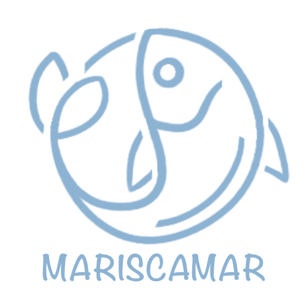

# Proxecto fin de ciclo

- [Proxecto fin de ciclo](#proxecto-fin-de-ciclo)
  - [Taboleiro do proyecto](#taboleiro-do-proyecto)
  - [Descrición](#descrición)
  - [Instalación / Posta en marcha](#instalación--posta-en-marcha)
  - [Uso](#uso)
  - [Sobre o autor](#sobre-o-autor)
  - [Licenza](#licenza)
  - [Índice](#índice)
  - [Guía de contribución](#guía-de-contribución)
  - [Links](#links)
## Taboleiro do proyecto

O proxecto **Mariscamar** atópase actualmente en fase funcional, coas principais funcionalidades operativas, aínda que segue sendo susceptible de melloras na interface, optimización do código e incorporación de pequenas funcionalidades adicionais.

[Páxina web de Mariscamar](https://mariscamar.up.railway.app)

## Descrición

  </img>

Una aplicación web pensada para facilitar a venda de marisco directamente desde as lonxas a compradores profesionais. A idea principal é ofrecer un sistema sinxelo no que as lonxas poidan crear as súas subastas, engadir os produtos dispoñibles e xestionar as cantidades á vender, mentres que os compradores poden participar nelas e adquirir o marisco, o sistema está pensado principalmente co sistema B2B(Business to Business). Esta diseñado para ser o mais intuitivo posible, mantendo a esencia do funcionamento tradicional das lonxas en un entorno dixital.

Para o desenvolvemento empregouse o framework Express e os lenguaxes: HTML, CSS e JS. Complementariamente utilízanse ferramentas como Visual Paradigm para os diagramas, Github para o control de versións e pgAdmin4 para o manexo da base de datos. O obxectivo final é crear unha plataforma práctica, segura e robusta que conecte aos diferentes partes do sector marisqueiro dun modo moderno e eficiente.

## Instalación / Posta en marcha

Para a posta en marcha do proxecto nun ambiente local faremos o seguinte:

  1 - Descarga os arquivos da carpeta src do repositorio
  
  2 - Instalación de dependencias e arranque

  - Descargar Node.js (no caso de non telo no equipo).
  - Comprobar con `npm -v` que está instalado correctamente.
  - Instalar as dependencias desde a raíz do proxecto co comando `npm install`.
  - Integrar as librerías usadas: `npm install bcrypt express-session`.
  - Lanzar o servidor con `npm start` ou `npm run dev` para comprobar que funcione correctamente.

  3 - Usar o script "mariscamar.sql" para crear a base de datos en PostgreSQL.
  
  4 - Executar "insertarDatosPrueba.js" para insertar datos de prueba na base de datos.

Con estos pasos estaríamos listos para continuar o desarrollo de forma local.
  
## Uso

A aplicación web destaca pola súa interface sinxela e intuitiva, permitindo ao usuario realizar todas as accións principais en poucos clics. Desde o panel inicial pódese acceder rapidamente ás funcións máis importantes, como a creación ou participación en poxas. Navegación fluída, con menús claros e opcións visibles en todo momento. 

Cada pantalla está deseñada para guiar ao usuario dun xeito natural, facilitando o uso incluso a persoas con pouca experiencia tecnolóxica. En poucos instantes o usuario pode realizar as operación necesarias para participar ou crear unha poxa de forma sencilla e eficiente.

## Sobre o autor

Son estudante do Ciclo Superior de Técnico en Desenvolvemento de Aplicacións Web. Teño formación en HTML, CSS, JavaScript, PHP, SQL e varios frameworks actuais, así como curiosidade constante por aprender novas tecnoloxías. Destaco pola miña capacidade para adaptarme ao entorno e de solucionar problemas de forma eficaz.

A motivación deste proxecto xorde da experiencia personal de traballar como mariscador nunha lonxa local que usaba os métodos tradicionais de venta de marisco, experimentando de primeira man os problemas e inquietudes que aparecen desde a perspectiva dun vendedor pequeno con clientes limitados, por isto decidimos crear esta aplicación web e aproveitar a oportunidade para entrar no sector. 

A forma máis fiable de contacto durante todo o proceso de creación do proxecto é o seguinte correo electrónico: chrislorenzorios@gmail.com

## Licenza

O proxecto Mariscamar esta licendiado con GNU Free Documentation Licence Version 1.3*, consultar ficheiro LICENSE en raíz.

## Índice

1. [Anteproyecto](doc/1_Anteproxecto.md)
2. [Análise](doc/2_Analise.md)
3. [Deseño](doc/3_Deseño.md)
4. [Codificación e probas](doc/4_Codificacion_e_probas.md)
5. [Implantación](doc/5_Implantación.md)
6. [Referencias](doc/6_Referencias.md)
7. [Incidencias](doc/7_Incidencias.md)

## Guía de contribución

Agradecemos a participación en ampliar Mariscamar, proxecto de software libre. Existen múltiples formas de colaborar no seu desarrollo, listamos varias posibilidades a continuación:

- Mellora e Optimización do Código:

    - Refactorización do código, para optimizar o rendemento do código Node.js/Express, especialmente na lóxica de poxa en tempo real.
  
    - Corrección de Bugs e identificación de erros identificados polos usuarios.

- Desenvolvemento de Novas Funcionalidades:

    - Implementación de funcionalidades como sistemas avanzados de filtros de busca de produtos ou melloras na área de administración de usuarios.
  
    - Desenvolvemento de novas interfaces para Lonxas e Compradores que faciliten a usabilidade e faciliten a entrada a novos usuarios.

    - Sistemas de alertas en tempo real de comezo, finalizacion de poxa e precio obxetivo.

- Testing:

    - Creación de probas unitarias e de integración para o backend (Node.js) e end-to-end para o fluxo de poxa en tempo real.
  
    - Probas de estrés para Socket.io e a base de datos PostgreSQL, asegurando que o sistema soporta un volume moderado de ofertas simultáneas.

- Documentación e Soporte:

    - Mellora e tradución da documentación técnica para facilitar futuros desarrollos.

- Integracións e Extensións:

    - Proposta e desenvolvemento de plugins ou módulos para a integración con servizos externos (por exemplo, pasarelas de pago adicionais ou sistemas de loxística).

## Links

> EXPLICACIÓN*: Ligazóns externas e descipciones destas ligazóns que creas conveniente indicar aquí. Xeralmente xa van estar integrados coa túa documentación, pero se requires realizar unha listaxe deles, leste é o lugar.
>
