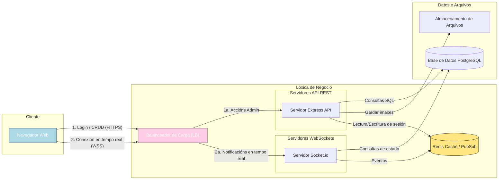

# FASE DE DESEÑO

- [FASE DE DESEÑO](#fase-de-deseño)
  - [1- Diagrama da arquitectura](#1--diagrama-da-arquitectura)
  - [2- Casos de uso](#2--casos-de-uso)
  - [3- Diagrama de Base de Datos](#3--diagrama-de-base-de-datos)
  - [4- Deseño de interface de usuarios](#4--deseño-de-interface-de-usuarios)

## 1- Diagrama da arquitectura

No seguinte diagrama mostramos o funcionamento de forma gráfica e sinxela entre as diferentes partes e a súa interrelación.

    
## 2- Casos de uso

### Diagrama de casos para a xestión de Mariscamar

  

## 3- Diagrama de Base de Datos

### Modelo Entidade/relación

  

### Modelo Relacional
Modelo relacional realizado coa plataforma ChartDB.io.  

  

## 4- Deseño de interface de usuarios
Prototipos compartidos por Figma [Enlace a proxecto](https://www.figma.com/design/2939dhrpvAX3bEHqzN4ft7/Prototipo-Mariscamar?node-id=0-1&p=f&t=BhOonfjNNnImdByy-0)

[**<-Anterior**](../../README.md)
