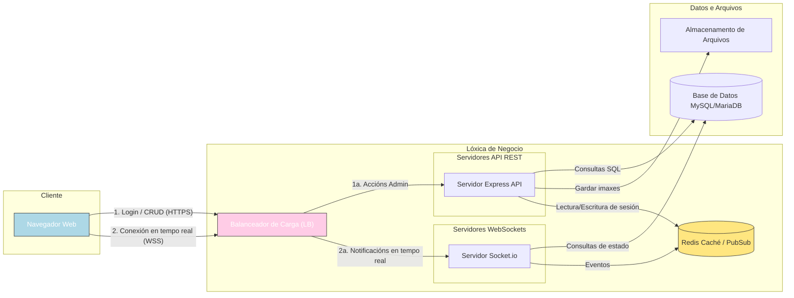

# FASE DE DESEÑO

- [FASE DE DESEÑO](#fase-de-deseño)
  - [1- Diagrama da arquitectura](#1--diagrama-da-arquitectura)
  - [2- Casos de uso](#2--casos-de-uso)
  - [3- Diagrama de Base de Datos](#3--diagrama-de-base-de-datos)
  - [4- Deseño de interface de usuarios](#4--deseño-de-interface-de-usuarios)

> *EXPLICACIÓN:* Este documento inclúe os diferentes diagramas, esquemas e deseños que axuden a describir mellor o [nome do proxecto] detallando os seus compoñentes, funcionalidades, bases de datos e interface.

## 1- Diagrama da arquitectura

No seguinte diagrama mostramos o funcionamento de forma gráfica e sinxela entre as diferentes partes e a súa interrelación.

    
## 2- Casos de uso

### Diagrama de casos para a xestión de Mariscamar

  

## 3- Diagrama de Base de Datos

### Modelo Entidade/relación

  

### Modelo Relacional
Modelo relacional realizado coa plataforma ChartDB.io.  

  

## 4- Deseño de interface de usuarios

> *EXPLICACIÓN:* Neste apartado deben incluírse unha mostra representativan dos mockups da aplicación. Estes mockups deben incluír todas as vistas da aplicación, é dicir, todas as páxinas diferentes que unha persoa usuaria (de calquera tipo) vai poder ver. Tamén se debe incluír información de como navegar dunha ventá a outra.
>
> Os mockups axudan no deseño da aplicación. Poden facerse á man, cunha aplicación ou a través dunha web do estilo: diagrams Un mockup permite ver como se verá unha páxina concreta dunha aplicación web. O deseño de mockups axuda a:
>
> - Avanzar moi rápido na parte frontend: ao ter os mockups realizados, permite saber que elementos vai ter cada vista e onde colocalos.
> - Visualizar a información que vai a ser necesaria mostrar. Sabendo con que información imos traballar e sabendo a información que necesitamos mostrar, podemos organizar os datos dunha forma axeitada para gardalos na base de datos.
>
> Se temos as ideas máis claras do noso proxecto podemos sustituir os mockups por prototipos.
>
[**<-Anterior**](../../README.md)
