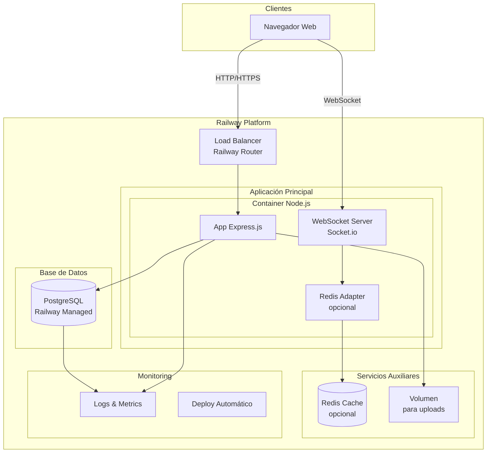

# FASE DE IMPLANTACIÓN

- [FASE DE IMPLANTACIÓN](#fase-de-implantación)
  - [1- Manual técnico](#1--manual-técnico)
    - [1.1- Instalación](#11--instalación)
    - [1.2- Administración do sistema](#12--administración-do-sistema)
  - [2- Manual de usuario](#2--manual-de-usuario)
  - [3- Melloras futuras](#3--melloras-futuras)

## 1- Manual técnico

### 1.1- Instalación

Os pasos e requisitos necesarios para a descarga e continuación do desenvolvemento deste proxecto son os seguintes:

1. Requerimentos:

    - Hardware recomendado:
        - Sobre 4GB de RAM.
        - Espazo suficiente no disco duro.
        - Conexión a internet estable.
        
    - Sofware:
        - Node.js.
        - Cliente SQL PgAdmin4 (recomendado) ou usar psql (liña de comandos).
        - Calquer editor de código compatible con Node.js.

2. Descarga os arquivos da carpeta src do repositorio
    
3. Instalación de dependencias e arranque

    - Descargar Node.js (no caso de non telo no equipo).
    - Comprobar con "<strong>npm -v</strong>" que este instalado correctamente.
    - Instalar as dependecias desde a raíz do proxecto co comando "<strong>npm install</strong>".
    - Integrar Socket.io no proxecto con "<strong>npm install socket.io</strong>"
    - Lanzamos o servidor con "<strong>npm start</strong>" ou "<strong>npm run dev</strong>" e deberíamos ver algo como o seguinte:

    

      
    

    
4. Configuración de base de datos

    - Dentro da carpeta src atopamos o directorio sql donde esta aloxado o arquivo mariscamar.sql, que conten o script para a creación da base de datos.

5. Usuarios iniciais

    - Existen 3 tipos de usuarios, que son: 
    
        - **Administrador**: Acceso completo o sistema
        
        - **Lonxa**: Xestión de produtos e poxas
        
        - **Comprador**: Participación en poxas

    Contamos con un script para crear datos de proba dentro da carpeta src, chamado insertarDatosPrueba.js.

    Na seguinte táboa indicamos usuarios de cada tipo para as probas necesarias.

    | Usuario              | Correo             | Contrasinal |
    |-------------------------|--------------------------|------------------|
    |  Admin  | admin@mariscamar.com |     abc123        |
    |  Lonxa / Vendedor   | lonxa.grove@mariscamar.com |    abc123     |
    |  Comprador |  restaurante.azul@email.com  |      abc123      |

7. Configuración de Railway para desplegar servidor

     - Servidor:
         1. Para poder desplegar o noso proxecto con Railway, crearemos un repositorio no que insertaremos o contido da carpeta src que previamente descargamos.
         2. Enlazaremos con Railway a nosa conta de Github e daremoslle permiso para acceder o repositorio que acabamos de crear co noso código.
           

             
           

         3. Unha vez seguido os pasos que nos piden, Railway prepara automáticamente o necesario para o despregue da nosa páxina.
         4. Para acabar teremos que elixir o nome do dominio que usaremos no seguinte menú e estaría listo para seu uso.
           

             
           

8. Diagrama de despregamento final

   Logo de decidir o sistema de despregramento que se vai utilizar, actualizamos o diagrama coa versión final.

---

### 1.2- Administración do sistema

En este apartado indicaremos a información relativa a administración do sistema, e dicir, as tarefas que teremos que realizar unha vez o sistema este funcionando.  

> [!IMPORTANT]
> Cabe destacar que para varias das tarefas estamos utilizando Railway, unha plataforma de desarollo e despregue en nube que simplifica moitas destas.

#### <ins>Copias de seguridade</ins>

**Base de datos**

Railway realiza copias de seguridade automáticas diariamente da base de datos PostgreSQL.
As copias consérvanse durante 7 días e poden restaurarse desde o panel de Railway cando sexa necesario.

**Código fonte**

Todo o código está gardado en GitHub, funcionando como copia de seguridade principal.

#### <ins>Xestión de usuarios</ins>

A xestión de usuarios realízase desde o panel de administración da aplicación. Entre as accións dispoñibles están:

   - Rexistro de novos usuarios (lonxas e compradores).

   - Edición de permisos e información de usuarios existentes.

   - Eliminación de contas inactivas durante mais de 6 meses.

#### <ins>Xestión de seguridade</ins>

**Infraestrutura (Railway)**

   - Certificados SSL/TLS automáticos.

   - Variables de contorno almacenadas de forma segura.

   - Acceso controlado mediante roles e permisos de equipo.

**Aplicación**

   - Contraseñas almacenadas como hash na base de datos.

   - Control de sesións e tempo de inactividade.

   - Validación de datos.

#### <ins>Xestión de incidencias</ins>

Railway xestiona automaticamente problemas de servidor notificando automáticamente os administradores en cuestión.

**Aplicación**

   - Comprobar periodicamente o estado e integridade dos datos gardados.
   
   - Informes de usuarios: atender as incidencias dos usuarios dende a aplicación.

## 2- Manual de usuario

Mariscamar diseñouse coa sinxeleza como principio fundamental. A plataforma funciona de forma intuitiva. Non se precisa formación nin instrucións demasiado complexas. Cada pantalla guía visualmente os usuarios para que cos botóns e opcións que ofrecemos poidas navegar comoda e rápidamente. 

Se sabes usar un navegador web e facer clics, xa sabes usar Mariscamar. A interface é limpa, directa e libre de complicacións innecesarias.

## 3- Melloras futuras

Durante o desenvolvemento de Mariscamar atopamos mais melloras a futuro que se poderían implementar para mellorar o servizo da web, mantemos as xa vistas e añadimos varios puntos a maiores na seguinte lista:

  - Alertas e notificacións en tempo real: Para que os compradores poidan saber se hai poxas novas ou temas de interés.
  - Sistema de precio obxetivo: Para que o comprador marque un precio que estaría disposto a pagar na poxa e compre automáticamente.
  - Vista de control de usuarios: Permitiría ver a actividade dos usuarios para poder administrar mais eficientemente, tanto suspensiones como limpieza de cuentas.
  - Sistemas de fidelización avanzado: Aforro por mercar maior volume, maiores recompensas por participación continuada e servizos premium. 
  - App móbil: Para facilitar o acceso e participación desde calquera dispositivo. 
  - Análise de datos e estatísticas: Explicacións de vendas, prezos e como se move o mercado para axudar a toma de decisións. 
  - Mellora na experiencia do usuario: Pantallas sinxelas, personalización e filtros avanzados para as subastas.

[**<-Anterior**](../../README.md)
